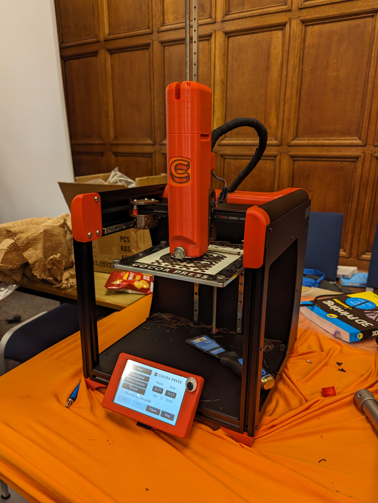
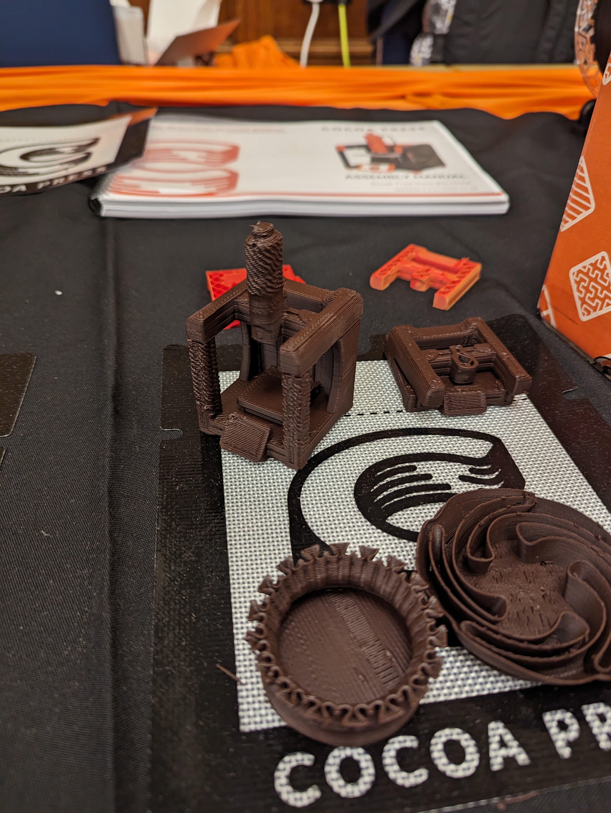
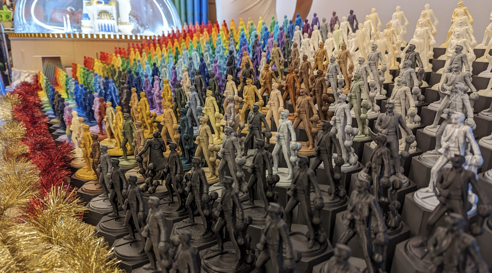
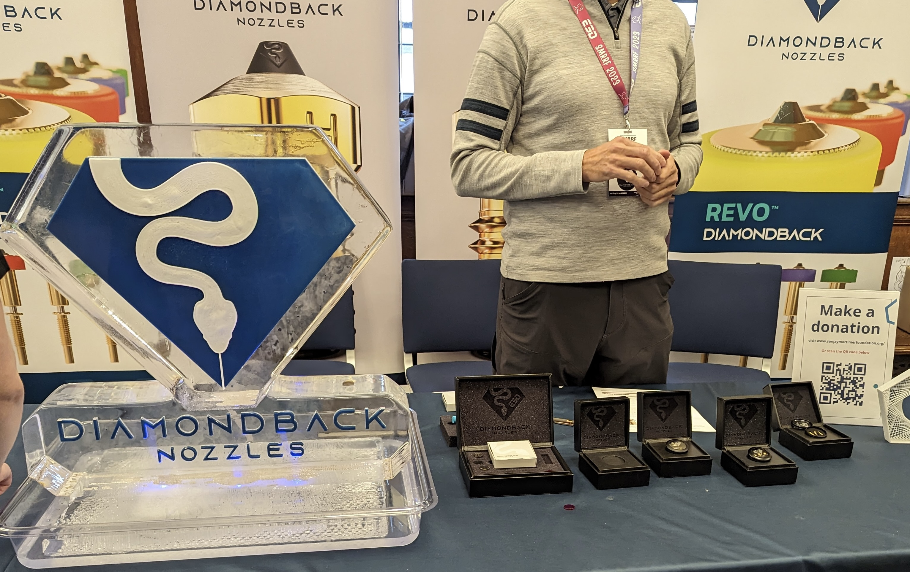

SMRRF 2024 is fast approaching, and it’s going to be a great event for anyone interested in DIY and especially 3D printing. If you’re wondering what it’s all about, I’ve finally made some time to write down my impressions from SMRRF 2023, in anticipation of this year’s event.

## What is SMRRF?
SMRRF, short for ‘Sanjay Mortimer RepRap Festival’, is a 3D printing event where makers come together to share knowledge, exhibit their 3D printed creations and meet fellow makers. Generally, RepRap festivals celebrate open source projects that benefit the making community, and in fact stem from Adrian Bowyer’s RepRap projects for self-replicating machines. 

SMRRF is not the only RepRap event, with several taking place in the US every year, but it is the only one in Europe, hosted in the UK by the Sanjay Mortimer Foundation (SMF), who are helping neurodivergent youth succeed in STEM. Sponsored by E3D, which Sanjay co-founded, they run the event in his memory (do read more about Sanjay [here](https://www.sanjaymortimerfoundation.org/about-sanjay)).

## Looking back to SMRRF 2023
SMRRF 2023 was held in a former Oxford University exam hall on the first weekend of December. For their first attempt at a RepRap festival, the SMF team did a wonderful job organising the event. 

Both Prusa and Voron Design attended, each showing off their newest machines, the Prusa XL and Voron Phoenix respectively. The variety of printers was too great to cover in detail, but we saw a Bambus, Enders, Vorons and some interesting printers over at Construct3D's booth. A fun highlight was seeing the Positron at LDO’s booth, a foldable printer that prints upside down. The best smelling printer, of course, was Cocoa Press’s, though sadly we didn’t get to taste any 3D printed chocolate – maybe this year! 

UK-based control board designers Duet3D were also there showcasing several of their boards, with their inductive bed mesh sensors working beautifully on an IDEX 3D printer. Many manufacturers of 3D printer parts were to be found, including Bigtreetech, LDO, and of course E3D, to name just a few. Filament suppliers like Polymaker and Cookiecad and UK vendors also attended. Academic lab groups showcased their research, with representatives from Loughborough University, Manchester Metropolitan University and Imperial College London all drawing a big crowd. 

But the team behind SMRRF had more than just exhibit tables planned for the event, with talks, raffles and auctions taking place in what was a packed weekend, with all money raised funding their excellent work. Talk topics varied from how Diamondback make their diamond-tipped nozzles to what Adrian Bowyer envisions the future of 3D printing to be, and while all of these were popular, the talk that everybody stopped for was given by Sanjay’s mother, who offered a wonderful account of Sanjay’s intense curiosity and dedication to being a maker. 

## My experience at SMRRF 2023
Last year’s event sounds amazing, right? Well, it was, and I for one have been counting down the days to this year’s event. It was so interesting to see the Prusa XL in action and I got to have some fascinating conversations. I had a chat with Prusa’s Mikolas about the workings of its tool-changing system, as well as seeing the massive Voron Phoenix that was unveiled at the event. I also chatted with Construct3D on why V wheels should exist on high end 3D printers, as well as why wood is a great side panel material. 

Overall, SMRRF felt like it really accomplished what it set out to do and became a true celebration of 3D printing and making. There was a huge variety of exhibits, and it was great to see that they consisted not only of various open source 3D printers but also projects made possible by/using 3D printing.

Still, the event was not without its flaws, and as always there are some things that could be improved for this year.

The event was split into two halls, with the stage set up right in the middle of one of them. This made listening to talks particularly difficult as so many people were in the hall talking. It seems that this is addressed this year with a separate room set up for talks. With the main halls being so loud, quiet spaces for discussions would have also been great, which again seems to be something the SMF team is aware of, as the 2024 event will have a dedicated quiet space for visitors and a room for sponsors to take a break in.

It should come as no surprise that big names like Voron and Prusa were immensely popular, and with them being in the same corner of the same hall, the crowds they drew made it hard for some of the smaller nearby tables to be noticed. We were hoping that this event will space them further apart, to allow space for the people trying to cross the room aand those marvelling at the Prusa and Voron tables. However, upon looking at the floor plan, all the platinum, gold and silver sponsors will be in one room, with all the bronze sponsors filling up the second room. This is unexpected but hopefully the venue is bigger for this to not impact crowd movements..

## Looking ahead to SMRRF 2024
This year’s SMRRF will be held in Manchester, on the 7th-8th of December 2024, at Manchester Metropolitan Business School. 

This year’s SMRRF is scheduled to have several exciting events, including DIY workshops, a game show by Joel Telling, a printed RC car race, and an educational space for children, among others. Last year’s events, like the raffle, auction, and various talks by sponsors will also be taking place this year. 

There is going to be a strong content creator presence, with Joel Telling from 3D Printing Nerd, Voron’s own content creator duo Steve (SteveBuilds) and Taylor (Canuck Creator), and many many more. Grant from 3D Musketeers shaved his head last year as part of the charity auction, so it remains to be seen if he has any other creative fundraising ideas this time around!

Many of last year’s exhibitors are making an appearance, including Prusa, Voron, Duet, Diamondback, Cocoa Press, and Millenium (who have now released the Milo CNC project they were showcasing last year). Make sure to not skip the north atrium as it will be filled with bronze sponsors, which are a big part of what makes RepRap festivals special. Bronze sponsors are usually individuals showcasing any recent projects, interests or just their nicest prints.There will likely be a wider variety of work and the booths areusually less busy so you can have longer and more memorable conversations.

I’m thrilled to be exhibiting this year and representing the [Global Disability Innovation Hub](https://www.disabilityinnovation.com), which is based at UCL. Along with some fellow researchers, we’ll be sharing our work on assistive technologies, which are made possible by 3D printing and other DIY practices. I’ll be showcasing my work on wheelchair seating comfort, with DIY approaches for pressure relief and thermal comfort. There will also be work on DIY refreshable pin-array displays and printable prosthetics.

If you’re coming along, drop by and check out our table in the middle of the south atrium!
